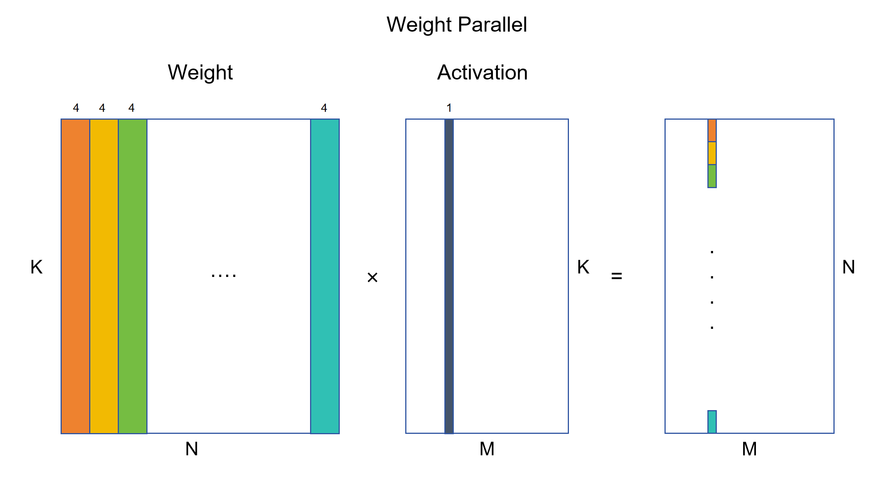
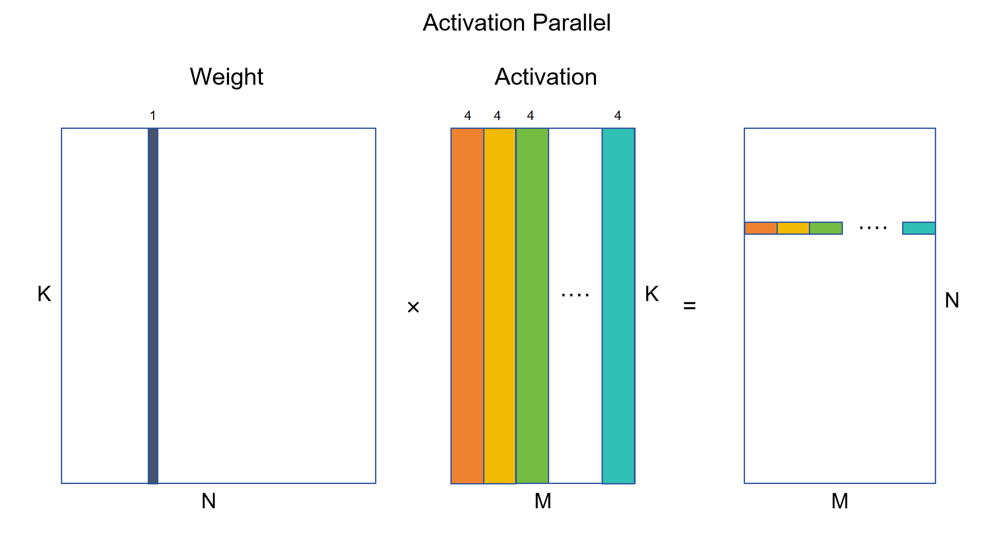
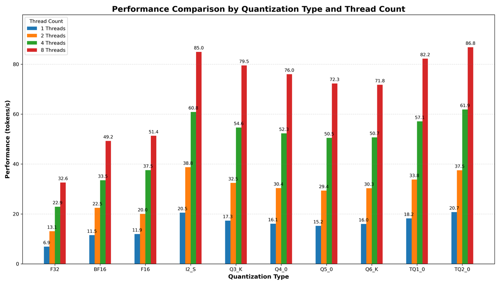
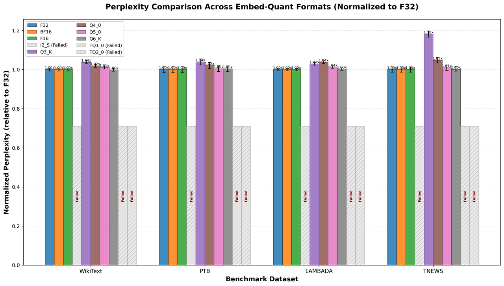

# BitNet CPU Inference Optimization

This update provides significant performance improvements for BitNet inference on CPU through paralleled kernel implementations, native I2_S GEMM/GEMV support, configurable tiling block size and embedding quantization.

## Update

- **Parallel Weight & Activation Computation**  
  Implemented parallel processing of weights and activations in the W2A8 vet_dot kernel, achieving improved throughput on both x86 and ARM architectures.

- **Native I2_S GEMM & GEMV Support**  
  Integrated I2_S GEMM and GEMV operations into ggml library, making them fully compatible with the llama.cpp architecture. This enables seamless integration with existing inference pipelines.

- **Configurable Tiling & Parallelism**  
  Introduced configurable GEMM & GEMV block sizes and parallelism levels, allowing performance fine-tuning for different CPU architectures.

- **Embedding Quantization**  
  Added support for embedding layer quantization with Q6_K format, reducing memory footprint and improving inference speed while maintaining high accuracy.

## Usage

### Configuration Options

The `gemm-config.h` file controls kernel behavior:

```c
#define ACT_PARALLEL  // Enable activation parallelism, otherwise weight parallelism

#if defined(ACT_PARALLEL)
    #define ROW_BLOCK_SIZE 4    // Number of rows processed per block
    #define COL_BLOCK_SIZE 32   // Number of columns processed per block
    #define PARALLEL_SIZE 4     // Degree of parallelism
#else
    #define ROW_BLOCK_SIZE 32
    #define COL_BLOCK_SIZE 4
    #define PARALLEL_SIZE 4
#endif
```

Modify these values based on your CPU cache size and architecture for optimal performance. Users can fine-tune performance on their machine through `gemm-config.h`.

### Enabling Embedding Quantization

To use embedding quantization for additional speedup:

```bash
build/bin/llama-quantize --token-embedding-type Q6_K models/BitNet-b1.58-2B-4T/ggml-model-f32.gguf models/BitNet-b1.58-2B-4T/ggml-model-i2_s-embed-q6_k.gguf I2_S 1 1
```

## Optimizations

### 1. Weight & Activation Parallelism

The key optimization introduces parallel processing paths for weight and activation computation:

- **Vectorized Operations:** Utilizes SIMD instructions (AVX2 for x86, NEON for ARM) to process multiple elements simultaneously
- **Parallel Accumulation:** Processes multiple weight-activation pairs in parallel, reducing sequential dependencies
- **Reduced Memory Latency:** Optimized memory access patterns minimize cache misses

**Schematic diagram:**




**Code Structure:**
- `ggml_vec_dot_i2_i8_s_1xN()`: Processes N rows in parallel
- `ggml_vec_dot_i2_i8_s_Nx1()`: Processes N columns in parallel
- Automatic dispatch based on `ACT_PARALLEL` configuration

### 2. GEMM/GEMV Integration with llama.cpp

Integrated I2_S quantization format into llama.cpp's compute graph:

- **GEMV Operations:** Optimized matrix-vector multiplication for token generation
- **GEMM Operations:** Efficient matrix-matrix multiplication for batch processing
- **Tiling Strategy:** Configurable block sizes for optimal cache utilization

**Benefits:**
- No modifications required to model architecture code
- Compatible with existing llama.cpp optimizations
- Supports dynamic batching and sequence parallelism

### 3. Embedding Quantization (Q6_K)

Quantizes embedding layers to 6-bit precision:

- **Quantization Method:** k-quants (Q6_K) with grouped quantization
- **Accuracy Preservation:** Maintains >99% similarity to FP32 embeddings
- **Memory Savings:** ~5.33x reduction in embedding size (FP32 → Q6_K)
- **Dequantization:** Automatic dequantization during forward pass

## Performance

### End-to-End Inference Performance

Comparison of optimized parallel kernels vs. original implementation:

**Test Configuration:**
- Model: BitNet-b1.58-2B-4T
- Hardware: AMD EPYC 7V13 64-Core Processor
- Threads: 1 / 2 / 4 / 8 / 12 / 16
- Test: 128 prompt tokens (pp128) + 128 generated tokens (tg128)
- Method: Activation Parallel

**Prompt Processing (pp128)**

| Threads | Original | Activation Parallel | Speedup |
|---------|----------|---------------------|---------|
| 1       |          | 47.49 ± 0.16        |         |
| 2       |          | 89.94 ± 0.25        |         |
| 4       |          | 169.61 ± 2.64       |         |
| 8       |          | 295.70 ± 3.19       |         |
| 12      |          | 403.04 ± 0.49       |         |
| 16      |          | 521.58 ± 0.95       |         |

**Token Generation (tg128)**

| Threads | Original | Activation Parallel | Speedup |
|---------|----------|---------------------|---------|
| 1       |          | 17.65 ± 0.16        |         |
| 2       |          | 32.24 ± 0.64        |         |
| 4       |          | 54.34 ± 0.12        |         |
| 8       |          | 74.42 ± 0.25        |         |
| 12      |          | 76.37 ± 0.18        |         |
| 16      |          | 74.02 ± 0.15        |         |

**Test Configuration:**
- Model: BitNet-b1.58-2B-4T
- Hardware: ARM Core
- Threads: 1 / 2 / 4 / 8
- Test: 128 prompt tokens (pp128) + 128 generated tokens (tg128)
- Method: Activation Parallel with DOTPROD

**Prompt Processing (pp128)**

| Threads | Original | Activation Parallel | Speedup |
|---------|----------|---------------------|---------|
| 1       |          |                     |         |
| 2       |          |                     |         |
| 4       |          |                     |         |
| 8       |          |                     |         |

**Token Generation (tg128)**

| Threads | Original | Activation Parallel | Speedup |
|---------|----------|---------------------|---------|
| 1       |          |                     |         |
| 2       |          |                     |         |
| 4       |          |                     |         |
| 8       |          |                     |         |

**Test Configuration:**
- Model: BitNet-b1.58-2B-4T
- Hardware: ARM Core
- Threads: 1 / 2 / 4 / 8
- Test: 128 prompt tokens (pp128) + 128 generated tokens (tg128)
- Method: Activation Parallel without DOTPROD

**Prompt Processing (pp128)**

| Threads | Original | Activation Parallel | Speedup |
|---------|----------|---------------------|---------|
| 1       |          |                     |         |
| 2       |          |                     |         |
| 4       |          |                     |         |
| 8       |          |                     |         |

**Token Generation (tg128)**

| Threads | Original | Activation Parallel | Speedup |
|---------|----------|---------------------|---------|
| 1       |          |                     |         |
| 2       |          |                     |         |
| 4       |          |                     |         |
| 8       |          |                     |         |

**Speedup Visualization:**

```
[TODO]
```

### Embedding Quantize Evaluation

**Performance test:**



**Quality test:**




## Technical Details

### Commit Information

- **Latest Commit:** `43da5e5f760887d5b061c95605cd89a7e63db76b`
- **Baseline Commit:** `404980eecae38affa4871c3e419eae3f44536a95`

### Key Files Modified

- `src/ggml-bitnet-mad.cpp`: Parallel kernel implementations
- `3rdparty/llama.cpp/ggml/src/ggml.c`: GEMM/GEMV integration
- `include/gemm-config.h`: Configuration file

### Supported Architectures

- ✅ x86-64 with AVX2
- ✅ ARM with NEON
- ✅ ARM with DOTPROD extension
